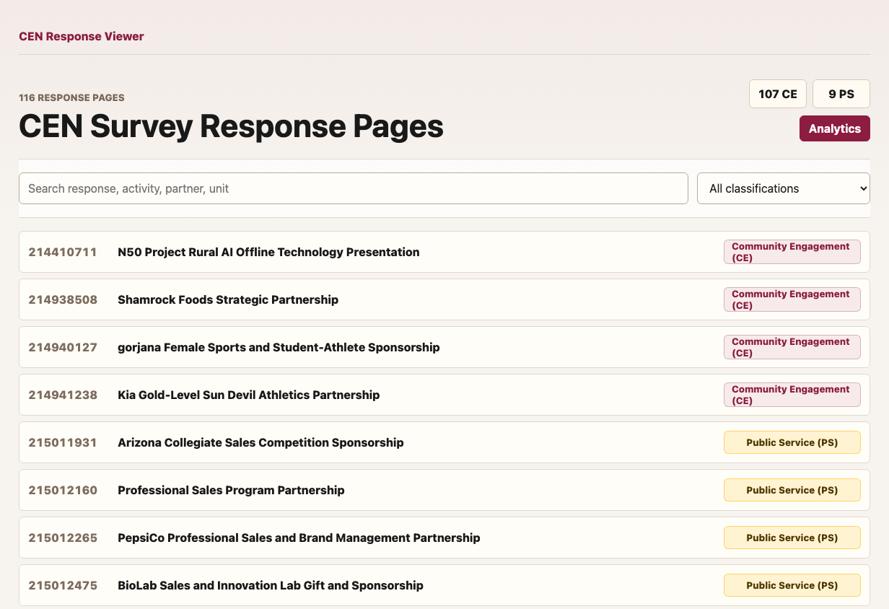
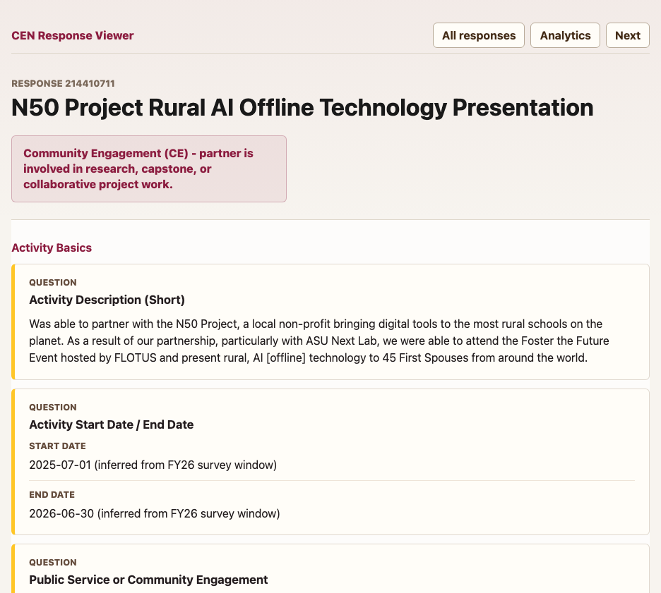
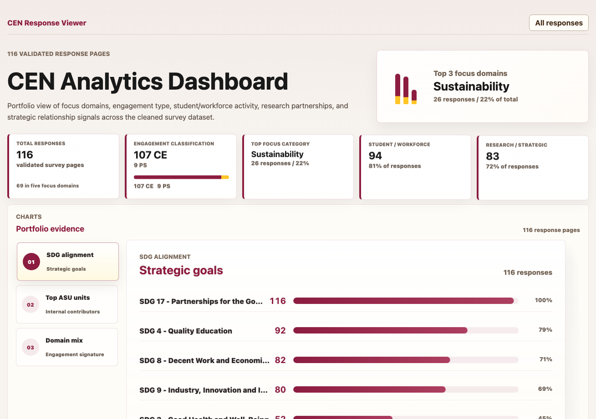
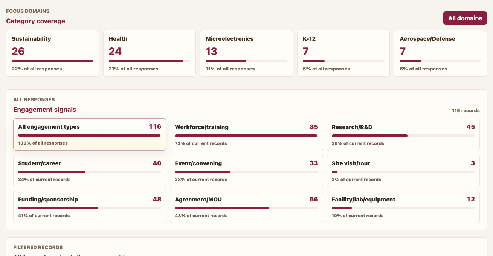

# CEN Data Dashboard

## Quick Links

- [Open the main dashboard](https://sanjaysoralamavu.github.io/cen-data-dashboard/)
- [Open the analytics page](https://sanjaysoralamavu.github.io/cen-data-dashboard/analytics)

## What This Dashboard Is

The CEN Data Dashboard is a website that turns CEN survey responses into something easier to read and explore.

Instead of scrolling through a spreadsheet, users can search for an activity, open a clean activity page, and look at charts that summarize the full set of responses.

In simple terms, the dashboard helps answer:

- What activities were reported?
- Who was involved?
- Which activities are Community Engagement or Public Service?
- What focus areas appear most often?
- What kinds of partnerships or engagement are happening?

## Main Dashboard Page

The main dashboard page is the starting point.

It shows all 116 response pages in a searchable list. Each row is one activity. Users can search by activity name, partner, ASU unit, or response ID.

The page also gives a quick count of the main activity types:

- 107 Community Engagement responses
- 9 Public Service responses

Use this page when you want to find and open a specific response.

## Individual Activity Pages

Each activity page shows one survey response in a cleaner format.

Instead of reading across a spreadsheet row, users can see the activity information grouped into readable sections. These pages may include the activity description, dates, ASU units, community partners, location, focus areas, benefits, outputs, outcomes, and community impact.

Use these pages when you want to review one activity carefully.

## Analytics Page

The analytics page gives a big-picture view of the full dataset.

At the top, the page highlights important summary numbers, such as:

- 116 total responses
- 107 Community Engagement responses
- 9 Public Service responses
- Sustainability as the top focus category
- 94 responses connected to student or workforce activity
- 83 responses connected to research or strategic relationship signals

Use this page when you want to understand overall patterns instead of looking at one response at a time.

## Portfolio Evidence Chart

The Portfolio Evidence section helps summarize the responses from different angles.

It includes views such as:

- SDG alignment
- top ASU units
- domain mix

For example, the SDG alignment view shows which Sustainable Development Goals appear most often across the responses. Longer bars mean that more responses are connected to that topic.

## Focus Domains And Engagement Signals

The Focus Domains section shows which major topic areas appear most often.

Current focus domains shown on the dashboard include:

- Sustainability
- Health
- Microelectronics
- K-12
- Aerospace/Defense

The Engagement Signals section shows what kinds of activity appear in the responses. Examples include workforce training, research, student or career activity, events, funding, agreements, and facility or lab activity.

These charts help users quickly see what the CEN activities are mostly about.

## Filtered Records

Below the charts, the dashboard shows the actual records behind the summary numbers.

Each record shows the response ID, activity name, focus area tags, and engagement tags. Clicking a record opens the full activity page.

This is useful because users can move from a chart summary to the real examples behind that chart.

## Why This Dashboard Is Useful

This dashboard makes the CEN survey data easier to explore, summarize, and explain.

It can help with:

- reviewing reported activities
- preparing summaries or reports
- finding examples of Community Engagement work
- understanding common focus areas
- seeing patterns across partners, activities, and outcomes

## Important Note

The analytics are meant to support review and understanding. The focus areas and engagement tags are helpful labels based on the dashboard data and matching rules, but they should still be reviewed when used for final reporting.
